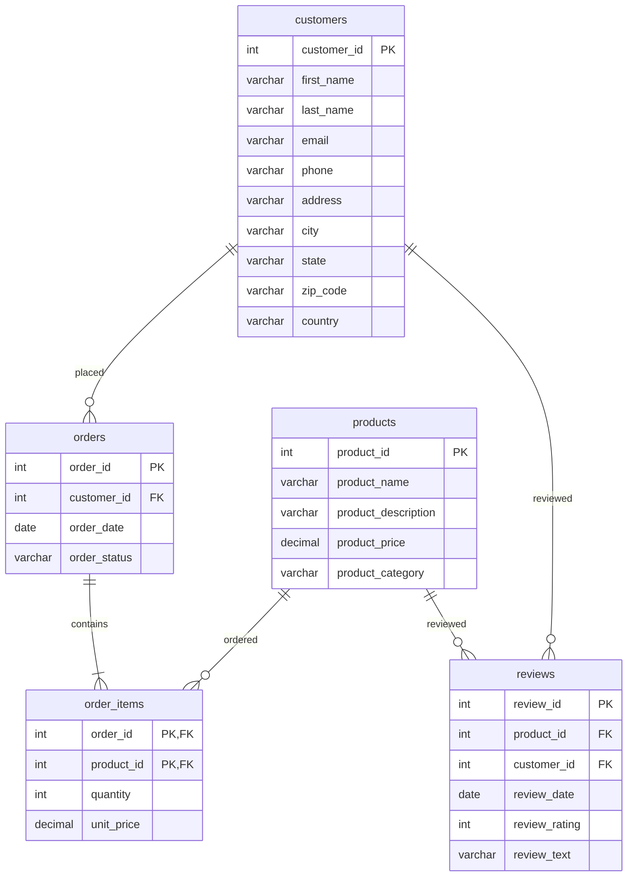

# Data Warehouse Schema Design Exercises
{: .no_toc}

Practice exercises for designing data warehouse schemas.


Possible solutions are provided under the collapsed "Solution" section for each exercise. (Note: The diagrams are created using [Mermaid](https://mermaid.js.org/syntax/entityRelationshipDiagram.html). Mermaid only supports `PK`, `FK`, and `UK` as keys. `FK` is used in place of surrogate keys and `UK` is used in place of alternate keys.)

## Table of Contents
{: .no_toc .text-delta }

1. TOC
{:toc}

---

## Exercise 1: E-commerce Website

### Scenario

You are designing a data warehouse schema for an e-commerce website. The website tracks customer activity, product information, orders, and reviews. The company has a website that allows customers to browse products, place orders, and write reviews. The company wants to analyze the sales of its products.

### Data

The website tracks customer activity, product information, orders, and reviews using a transactional relational database. The database contains the following tables:



### Requirements

- Create a data warehouse schema that will allow the company to analyze the sales of its products.

<details>
<summary markdown="span">Solution</summary>

{: .solution }
> In order to analyze the sales of its products, the company needs to be able to analyze the orders placed by customers. This means that the fact table should primarily contain information about the orders placed. To help speed up queries, it is necessary to denormalize the `order_items` table back into the `orders` table.
>
> If we leave out the `reviews` table for now (we'll come back to it later), we can create a star schema with the `orders` table as the fact table and the `customers`, `products`, and `dates` as the dimension tables.
>
> ```mermaid
> erDiagram
>     FactOrders ||--|{ DimCustomers : "placed"
>     FactOrders ||--|{ DimProducts : "ordered"
>     FactOrders ||--|{ DimDates : "ordered"
>
>     FactOrders {
>         int order_key PK
>         int order_id UK
>         int customer_key FK
>         int product_key FK
>         date order_date_key FK
>         int quantity
>         decimal total_price
>     }
>
>     DimCustomers {
>         int customer_key PK
>         int customer_id UK
>         varchar first_name
>         varchar last_name
>         varchar email
>         varchar phone
>         varchar address
>         varchar city
>         varchar state
>         varchar zip_code
>         varchar country
>     }
>
>     DimProducts {
>         int product_key PK
>         int product_id UK
>         varchar product_name
>         varchar product_description
>         decimal product_price
>         varchar product_category
>     }
>
>     DimDates {
>         int order_date_key PK
>         date order_date
>         int day_of_week
>         int month
>         int year
>     }
> ```
>
> Including `reviews` in the schema is a bit more complicated. The `reviews` table is related to both the `products` and `customers` tables. `review_date` can also make use of the `DimDates` table.
>
> ```mermaid
> erDiagram
>     FactOrders ||--|{ DimCustomers : "placed"
>     FactOrders ||--|{ DimProducts : "ordered"
>     FactOrders ||--|{ DimDates : "ordered"
>     DimReviews ||--o{ DimProducts : "reviewed"
>     DimReviews ||--o{ DimCustomers : "reviewed"
>     DimReviews ||--o{ DimDates : "reviewed"
>
>     FactOrders {
>         int order_key PK
>         int order_id UK
>         int customer_key FK
>         int product_key FK
>         date order_date_key FK
>         int quantity
>         decimal total_price
>     }
>
>     DimCustomers {
>         int customer_key PK
>         int customer_id UK
>         varchar first_name
>         varchar last_name
>         varchar email
>         varchar phone
>         varchar address
>         varchar city
>         varchar state
>         varchar zip_code
>         varchar country
>     }
>
>     DimProducts {
>         int product_key PK
>         int product_id UK
>         varchar product_name
>         varchar product_description
>         decimal product_price
>         varchar product_category
>     }
>
>     DimReviews {
>         int review_key PK
>         int review_id UK
>         int product_id FK
>         int customer_id FK
>         date review_date FK
>         int review_rating
>         varchar review_text
>     }
>
>     DimDates {
>         int order_date_key PK
>         date order_date
>         int day_of_week
>         int month
>         int year
>     }
> ```
>
> Creating the tables in t-SQL:
>
> ```sql
> CREATE TABLE DimCustomers (
>     customer_key INT IDENTITY NOT NULL,
>     customer_id INT NULL,
>     first_name NVARCHAR(50) NOT NULL,
>     last_name NVARCHAR(50) NOT NULL,
>     email NVARCHAR(50) NULL,
>     phone VARCHAR(50) NULL,
>     address NVARCHAR(50),
>     city NVARCHAR(50),
>     state NVARCHAR(50),
>     zip_code NVARCHAR(50),
>     country NVARCHAR(50)
> );
>
> CREATE TABLE DimProducts (
>     product_key INT IDENTITY NOT NULL,
>     product_id INT NULL,
>     product_name NVARCHAR(50) NOT NULL,
>     product_description NVARCHAR(200) NOT NULL,
>     product_price DECIMAL(10,2) NOT NULL,
>     product_category NVARCHAR(50) NOT NULL
> );
>
> CREATE TABLE DimDates (
>     order_date_key INT IDENTITY NOT NULL,
>     order_date DATE NOT NULL,
>     day_of_week INT NOT NULL,
>     month INT NOT NULL,
>     year INT NOT NULL
> );
>
> CREATE TABLE FactOrders (
>     order_key INT IDENTITY NOT NULL,
>     order_id INT NULL,
>     customer_key INT NOT NULL,
>     product_key INT NOT NULL,
>     order_date_key INT NOT NULL,
>     quantity INT NOT NULL,
>     total_price DECIMAL(10,2) NOT NULL
> );
>
> CREATE TABLE DimReviews (
>     review_key INT IDENTITY NOT NULL,
>     review_id INT NULL,
>     product_key INT NOT NULL,
>     customer_key INT NOT NULL,
>     review_date_key INT NOT NULL,
>     review_rating INT NOT NULL,
>     review_text NVARCHAR(200) NOT NULL
> );
> ```
>
> This is only a possible solution. Specific business requirements and data chatracteristics may require a different schema design.

</details>

---

## Exercise 2: Hospital Management System

### Scenario

You are a data engineer for a hospital. You are tasked with creating a data warehouse for the hospital to store patient information, medical records, doctor details, and appointment data. The hospital wants to be able to analyze the data in the data warehouse to improve its operations. The system should be able to answer questions such as:

- How many patient appointments are there each day/month/year?
- How many appointments does each doctor have each day/month/year?
- Which department is the busiest each day/month/year?

### Data

The following data needs to be stored in the data warehouse:

| Entity | Attributes |
| --- | --- |
| Patient | `Patient ID`, `first name`, `last name`, `DoB`, `gender`, `phone`, `address`, `city`, `state`, `zip code`, `country` |
| Doctor | `Doctor ID`, `first name`, `last name`, `email`, `phone`, `department ID`, `specialisation` |
| Appointment | `Appointment ID`, `Patient`, `Doctor`, `appointment date`, `appointment time` |
| Department | `Department ID`, `department name`, `location` |
| Medical Record | `Record ID`, `Patient ID`, `doctor ID`, `medical record date`, `medical record time`, `diagnosis`, `treatment`, `prescription` |

### Requirements

- The data warehouse should be able to store the data listed above.
- The schema should be optimized for analysing appointments.

<details>
<summary markdown="span">Solution</summary>

{: .solution }
> We can use a star schema to store the data. The `Appointment` table will be the fact table. The `Patient`, `Doctor`, and `Department` tables will be the dimension tables. An additional `DateTime` dimension table will be created to store the date of each appointment.
>
> `Medical Record` can be added as a fact table or a dimension table. It is not clear from the requirements whether the hospital wants to analyze medical records. `Medical Record` is related to both `Patient` and `Doctor`. It is not directly related to `Appointment`.
>
> The hospital say that they only want to analyse appointments down to per day. Therefore, we can use a `Date` dimension table instead of a `DateTime` dimension table. If, however, the hospital was interested in analysing busy periods during the day, we would need to use a `DateTime` dimension table with lower time granularity (e.g. 15 minutes).
>
> ```mermaid
> erDiagram
>     FactAppointments ||--|{ DimPatients : "patient"
>     FactAppointments ||--|{ DimDoctors : "doctor"
>     FactAppointments ||--|{ DimDepartments : "department"
>     FactAppointments ||--|{ DimDate : "appointment"
>     DimMedicalRecords ||--o{ DimPatients : "patient"
>     DimMedicalRecords ||--o{ DimDoctors : "doctor"
>
>     FactAppointments {
>         int appointment_key PK
>         int appointment_id UK
>         int patient_key FK
>         int doctor_key FK
>         int department_key FK
>         int appointment_date FK
>         time appointment_time
>     }
>
>     DimPatients {
>         int patient_key PK
>         int patient_id UK
>         varchar first_name
>         varchar last_name
>         date date_of_birth
>         varchar gender
>         varchar phone
>         varchar address
>         varchar city
>         varchar state
>         varchar zip_code
>         varchar country
>     }
>
>     DimDoctors {
>         int doctor_key PK
>         int doctor_id UK
>         varchar first_name
>         varchar last_name
>         varchar email
>         varchar phone
>         int department_key FK
>         varchar specialisation
>     }
>
>     DimDepartments {
>         int department_key PK
>         int department_id UK
>         varchar department_name
>         varchar location
>     }
>
>     DimDate {
>         int date_key PK
>         date date
>         int day_of_week
>         int month
>         int year
>     }
>
>     DimMedicalRecords {
>         int medical_record_key PK
>         int medical_record_id UK
>         int patient_key FK
>         int doctor_key FK
>         date medical_record_date
>         time medical_record_time
>         varchar diagnosis
>         varchar treatment
>         varchar prescription
>     }
>
> ```
>
> To create the tables in SQL Server (Remember, dimension tables should be created before the fact table):
>
> ```sql
> CREATE TABLE DimPatients (
>     patient_key INT IDENTITY NOT NULL,
>     patient_id INT NULL,
>     first_name NVARCHAR(50) NOT NULL,
>     last_name NVARCHAR(50) NOT NULL,
>     date_of_birth DATE NOT NULL,
>     gender NVARCHAR(10) NOT NULL,
>     phone NVARCHAR(20) NOT NULL,
>     address NVARCHAR(100) NOT NULL,
>     city NVARCHAR(50) NOT NULL,
>     state NVARCHAR(50) NOT NULL,
>     zip_code NVARCHAR(20) NOT NULL,
>     country NVARCHAR(50) NOT NULL
> );
>
> CREATE TABLE DimDoctors (
>     doctor_key INT IDENTITY NOT NULL,
>     doctor_id INT NULL,
>     first_name NVARCHAR(50) NOT NULL,
>     last_name NVARCHAR(50) NOT NULL,
>     email NVARCHAR(100) NOT NULL,
>     phone NVARCHAR(20) NOT NULL,
>     department_key INT NOT NULL,
>     specialisation NVARCHAR(50) NOT NULL
> );
>
> CREATE TABLE DimDepartments (
>     department_key INT IDENTITY NOT NULL,
>     department_id INT NULL,
>     department_name NVARCHAR(50) NOT NULL,
>     location NVARCHAR(50) NOT NULL
> );
>
> CREATE TABLE DimDate (
>     date_key INT IDENTITY NOT NULL,
>     date DATE NOT NULL,
>     day_of_week INT NOT NULL,
>     month INT NOT NULL,
>     year INT NOT NULL
> );
>
> CREATE TABLE DimMedicalRecords (
>     medical_record_key INT IDENTITY NOT NULL,
>     medical_record_id INT NULL,
>     patient_key INT NOT NULL,
>     doctor_key INT NOT NULL,
>     medical_record_date DATE NOT NULL,
>     medical_record_time TIME NOT NULL,
>     diagnosis NVARCHAR(100) NOT NULL,
>     treatment NVARCHAR(100) NOT NULL,
>     prescription NVARCHAR(100) NOT NULL
> );
>
> CREATE TABLE FactAppointments (
>     appointment_key INT IDENTITY NOT NULL,
>     appointment_id INT NULL,
>     patient_key INT NOT NULL,
>     doctor_key INT NOT NULL,
>     department_key INT NOT NULL,
>     appointment_date_key INT NOT NULL,
>     appointment_time TIME NOT NULL
> );
>
> ```
>
> This is only a possible solution. More detailed requirements and data chatracteristics may require a different schema design.

</details>

---

## Exercise 3: Financial Institution

### Scenario

You are a data engineer for a financial institution. You are tasked with designing a data warehouse schema for a financial institution. The institution wants to analyze transaction data, customer details, account information, and branch performance. The system should be able to answer the following questions:

- How many transactions were made by each customer?
- How many transactions were made by each account?
- How many transactions were made each day/month/year?
- What is the average transaction amount for each customer? (per day/month/year)
- What is the total transaction amount for each customer? (per day/month/year)

### Data

The following data needs to be stored in the data warehouse:

| Entity | Attributes |
| --- | --- |
| Transactions | `transaction_id`, `transaction_date`, `transaction_time`, `transaction_type`, `transaction_amount`, `customer_id`, `account_id` |
| Customers | `customer_id`, `first_name`, `last_name`, `address`, `city`, `state`, `zip_code`, `country`, `phone`, `email` |
| Accounts | `account_id`, `customer_id`, `account_type`, `account_balance`, `open_date`, `branch_id` |
| Branches | `branch_id`, `branch_name`, `location`, `manager` |

### Requirements

- Create a data warehouse schema that will allow the institution to analyze transaction data, customer details, account information, and branch performance.

<details>
<summary markdown="span">Solution</summary>

{: .solution }
> A snowflake schema is a good choice for this scenario as `branches` isn't directly related to `transactions` and isn't being analysed. If branch performance was being analysed, then a star schema would be a better choice.
>
> The following diagram shows a possible solution:
>
> ```mermaid
> erDiagram
>     FactTransactions ||--|{ DimCustomers : "has"
>     FactTransactions ||--|{ DimAccounts : "has"
>     FactTransactions ||--|{ DimDate : "on"
>     DimCustomers ||--|{ DimAccounts : "has"
>     DimAccounts ||--|{ DimBranches : "has"
>     DimAccounts ||--|{ DimDate : "opened"
>
>     FactTransactions {
>         int transaction_id PK
>         int customer_key FK
>         int account_key FK
>         int transaction_date_key FK
>         time transaction_time
>         varchar transaction_type
>         decimal transaction_amount
>     }
>
>     DimCustomers {
>         int customer_key PK
>         int customer_id UK
>         varchar first_name
>         varchar last_name
>         varchar address
>         varchar city
>         varchar state
>         varchar zip_code
>         varchar country
>         varchar phone
>         varchar email
>     }
>
>     DimAccounts {
>         int account_key PK
>         int account_id UK
>         int customer_id FK
>         varchar account_type
>         decimal account_balance
>         date open_date FK
>         int branch_key FK
>     }
>
>     DimBranches {
>         int branch_key PK
>         int branch_id UK
>         varchar branch_name
>         varchar location
>         varchar manager
>     }
>
>     DimDate {
>         int date_key PK
>         date date
>         int day_of_week
>         int month
>         int year
>     }
>
> ```
>
> To create the schema, the following SQL can be used:
>
> ```sql
> CREATE TABLE DimCustomers (
>     customer_key INT IDENTITY NOT NULL,
>     customer_id INT NULL,
>     first_name NVARCHAR(50) NOT NULL,
>     last_name NVARCHAR(50) NOT NULL,
>     address NVARCHAR(100) NOT NULL,
>     city NVARCHAR(50) NOT NULL,
>     state NVARCHAR(50) NOT NULL,
>     zip_code NVARCHAR(20) NOT NULL,
>     country NVARCHAR(50) NOT NULL,
>     phone NVARCHAR(20) NOT NULL,
>     email NVARCHAR(100) NOT NULL
> );
>
> CREATE TABLE DimAccounts (
>     account_key INT IDENTITY NOT NULL,
>     account_id INT NULL,
>     customer_id INT NOT NULL,
>     account_type NVARCHAR(50) NOT NULL,
>     account_balance DECIMAL(10, 2) NOT NULL,
>     open_date DATE NOT NULL,
>     branch_key INT NOT NULL
> );
>
> CREATE TABLE DimBranches (
>     branch_key INT IDENTITY NOT NULL,
>     branch_id INT NULL,
>     branch_name NVARCHAR(50) NOT NULL,
>     location NVARCHAR(50) NOT NULL,
>     manager NVARCHAR(50) NOT NULL
> );
>
> CREATE TABLE DimDate (
>     date_key INT IDENTITY NOT NULL,
>     date DATE NOT NULL,
>     day_of_week INT NOT NULL,
>     month INT NOT NULL,
>     year INT NOT NULL
> );
>
> CREATE TABLE FactTransactions (
>     transaction_id INT IDENTITY NOT NULL,
>     customer_key INT NOT NULL,
>     account_key INT NOT NULL,
>     transaction_date_key INT NOT NULL,
>     transaction_time TIME NOT NULL,
>     transaction_type NVARCHAR(50) NOT NULL,
>     transaction_amount DECIMAL(10, 2) NOT NULL
> );
> ```
>
> To answer the questions, the following queries can be used:
>
> ```sql
> -- How many transactions were made by each customer?
> SELECT
>     c.customer_id,
>     c.first_name,
>     c.last_name,
>     COUNT(t.transaction_id) AS transaction_count
> FROM
>     DimCustomers c
>     INNER JOIN FactTransactions t ON c.customer_key = t.customer_key
> GROUP BY
>     c.customer_id,
>     c.first_name,
>     c.last_name
> ORDER BY
>     transaction_count DESC;
>
> -- How many transactions were made by each account?
> SELECT
>     a.account_id,
>     COUNT(t.transaction_id) AS transaction_count
> FROM
>     DimAccounts a
>     INNER JOIN FactTransactions t ON a.account_key = t.account_key
> GROUP BY
>     a.account_id
> ORDER BY
>     transaction_count DESC;
>
> -- How many transactions were made each day/month/year?
> SELECT
>     d.date,
>     COUNT(t.transaction_id) AS transaction_count
> FROM
>     DimDate d
>     INNER JOIN FactTransactions t ON d.date_key = t.transaction_date_key
> GROUP BY
>     d.date
> ORDER BY
>     transaction_count DESC;
>
> -- What is the average transaction amount for each customer? (per day/month/year)
> SELECT
>     c.customer_id,
>     c.first_name,
>     c.last_name,
>     d.date,
>     AVG(t.transaction_amount) AS average_transaction_amount
> FROM
>     DimCustomers c
>     INNER JOIN FactTransactions t ON c.customer_key = t.customer_key
>     INNER JOIN DimDate d ON t.transaction_date_key = d.date_key
> GROUP BY
>     c.customer_id,
>     c.first_name,
>     c.last_name,
>     d.date
> ORDER BY
>     average_transaction_amount DESC;
>
> -- What is the total transaction amount for each customer? (per day/month/year)
> SELECT
>     c.customer_id,
>     c.first_name,
>     c.last_name,
>     d.date,
>     SUM(t.transaction_amount) AS total_transaction_amount
> FROM
>     DimCustomers c
>     INNER JOIN FactTransactions t ON c.customer_key = t.customer_key
>     INNER JOIN DimDate d ON t.transaction_date_key = d.date_key
> GROUP BY
>     c.customer_id,
>     c.first_name,
>     c.last_name,
>     d.date
> ORDER BY
>     total_transaction_amount DESC;
> ```

</details>

---

## Exercise 4: Human Resources Analytics

### Scenario

You are a data engineer working for a human resources department. The department wants to analyze employee data, performance metrics, training records, and recruitment information. You have been tasked with designing a data warehouse schema to support this analysis.

### Data

The following data is available:

| Type | Attributes |
| --- | --- |
| Employee | `EmployeeID`, `Name`, `Department`, `Position`, `HireDate`, `ManagerID` |
| Department | `DepartmentID`, `DepartmentName` |
| Metric | `MetricID`, `MetricName`, `Description` |
| Training | `TrainingID`, `EmployeeID`, `TrainingName`, `TrainingDate`, `Duration` |
| Recruitment | `RecruitmentID`, `Position`, `RecruiterID`, `RecruitmentDate` |

Metrics are collected on a daily basis. The following metrics are collected:

| Metric Type | Description |
| --- | --- |
| Performance | Employee performance metrics. |
| Training | Employee training metrics. |
| Recruitment | Recruitment metrics. |

Each metric has a value associated with it. The values for each metric are all numeric in a similar range.

### Requirements

1. Create a fact table to store employee metrics.
2. Create dimension tables to store employee, department, metric, training, and recruitment information.
3. Create a diagram to show the relationships between the tables.

Hint: Recruiters are also employees.

<details>
<summary markdown="span">Solution</summary>

{: .solution }
> A snowflake schema is a good choice for this scenario. Metric values should be pre-calculated and stored in the fact table, rather than using a query to calculate them during analysis. The following diagram shows a possible solution:
>
> ```mermaid
> erDiagram
>     FactEmployeeMetrics ||--o{ DimEmployees : "EmployeeKey"
>     FactEmployeeMetrics ||--o{ DimMetrics : "MetricKey"
>     FactEmployeeMetrics ||--o{ DimDate : "DateKey"
>     DimEmployees ||--|{ DimDepartments : "DepartmentKey"
>     DimEmployees ||--|{ DimEmployees : "ManagerKey"
>     DimEmployees ||--o{ DimDate : "HireDate"
>     DimTrainings ||--o{ DimEmployees : "EmployeeKey"
>     DimTrainings ||--o{ DimDate : "TrainingDate"
>     DimRecruitments ||--o{ DimEmployees : "RecruiterKey"
>     DimRecruitments ||--o{ DimDate : "RecruitmentDate"
>
>     FactEmployeeMetrics {
>         int EmployeeMetricKey PK
>         int EmployeeKey FK
>         int MetricType FK
>         int MetricDate FK
>         int Value
>     }
>
>     DimEmployees {
>         int EmployeeKey PK
>         int EmployeeID UK
>         varchar Name
>         int DepartmentKey FK
>         int Position
>         date HireDate
>         int ManagerKey FK
>     }
>
>     DimDepartments {
>         int DepartmentKey PK
>         int DepartmentID UK
>         varchar DepartmentName
>     }
>
>     DimMetrics {
>         int MetricKey PK
>         int MetricID UK
>         varchar MetricName
>         varchar Description
>     }
>
>     DimTrainings {
>         int TrainingKey PK
>         int TrainingID UK
>         int EmployeeKey FK
>         varchar TrainingName
>         date TrainingDate
>         int Duration
>     }
>
>     DimRecruitments {
>         int RecruitmentKey PK
>         int RecruitmentID UK
>         int Position
>         int RecruiterKey FK
>         date RecruitmentDate
>     }
>
>     DimDate {
>         int DateKey PK
>         date Date
>         int DayOfWeek
>         int Month
>         int Year
>     }
> ```
>
> If we take out the `DimDate` table for a moment, it's a bit easier to see the schema structure:
>
> ```mermaid
> erDiagram
>     FactEmployeeMetrics ||--o{ DimEmployees : "EmployeeKey"
>     FactEmployeeMetrics ||--o{ DimMetrics : "MetricKey"
>     DimEmployees ||--|{ DimDepartments : "DepartmentKey"
>     DimEmployees ||--|{ DimEmployees : "ManagerKey"
>     DimTrainings ||--o{ DimEmployees : "EmployeeKey"
>     DimRecruitments ||--o{ DimEmployees : "RecruiterKey"
>
>     FactEmployeeMetrics {
>         int EmployeeMetricKey PK
>         int EmployeeKey FK
>         int MetricType FK
>         int MetricDate FK
>         int Value
>     }
>
>     DimEmployees {
>         int EmployeeKey PK
>         int EmployeeID UK
>         varchar Name
>         int DepartmentKey FK
>         int Position
>         date HireDate
>         int ManagerKey FK
>     }
>
>     DimDepartments {
>         int DepartmentKey PK
>         int DepartmentID UK
>         varchar DepartmentName
>     }
>
>     DimMetrics {
>         int MetricKey PK
>         int MetricID UK
>         varchar MetricName
>         varchar Description
>     }
>
>     DimTrainings {
>         int TrainingKey PK
>         int TrainingID UK
>         int EmployeeKey FK
>         varchar TrainingName
>         date TrainingDate
>         int Duration
>     }
>
>     DimRecruitments {
>         int RecruitmentKey PK
>         int RecruitmentID UK
>         int Position
>         int RecruiterKey FK
>         date RecruitmentDate
>     }
> ```
>
> The following tables can be created:
>
> ```sql
> CREATE TABLE DimEmployees (
>     EmployeeKey INT IDENTITY(1,1) NOT NULL,
>     EmployeeID INT UNIQUE NOT NULL,
>     Name VARCHAR(50) NOT NULL,
>     DepartmentKey INT NOT NULL,
>     Position INT NOT NULL,
>     HireDate DATE NOT NULL,
>     ManagerKey INT NOT NULL
> );
>
> CREATE TABLE DimDepartments (
>     DepartmentKey INT IDENTITY(1,1) NOT NULL,
>     DepartmentID INT UNIQUE NOT NULL,
>     DepartmentName VARCHAR(50) NOT NULL
> );
>
> CREATE TABLE DimMetrics (
>     MetricKey INT IDENTITY(1,1) NOT NULL,
>     MetricID INT UNIQUE NOT NULL,
>     MetricName VARCHAR(50) NOT NULL,
>     Description VARCHAR(100) NOT NULL
> );
>
> CREATE TABLE DimTrainings (
>     TrainingKey INT IDENTITY(1,1) NOT NULL,
>     TrainingID INT UNIQUE NOT NULL,
>     EmployeeKey INT NOT NULL,
>     TrainingName VARCHAR(50) NOT NULL,
>     TrainingDate DATE NOT NULL,
>     Duration INT NOT NULL
> );
>
> CREATE TABLE DimRecruitments (
>     RecruitmentKey INT IDENTITY(1,1) NOT NULL,
>     RecruitmentID INT UNIQUE NOT NULL,
>     Position INT NOT NULL,
>     RecruiterKey INT NOT NULL,
>     RecruitmentDate DATE NOT NULL
> );
>
> CREATE TABLE DimDate (
>     DateKey INT IDENTITY(1,1) NOT NULL,
>     Date DATE NOT NULL,
>     DayOfWeek INT NOT NULL,
>     Month INT NOT NULL,
>     Year INT NOT NULL
> );
>
> CREATE TABLE FactEmployeeMetrics (
>     EmployeeMetricKey INT IDENTITY(1,1) NOT NULL,
>     EmployeeKey INT NOT NULL,
>     MetricDate INT NOT NULL,
>     MetricType INT NOT NULL,
>     Value INT NOT NULL
> );
> ```

</details>

---

## Exercise 5: Inventory Management

### Scenario

You are tasked with designing a data warehouse schema for an inventory management system. The system needs to track product inventory, supplier information, orders, and shipment details. The company behind the inventory management system want to be able to answer the following questions:

- How many products do we have in stock?
- How often do we order from each supplier?
- How many products do we order from each supplier?
- What is the total value of inventory for each product?
- What is the total value of inventory for each supplier?
- What is the total value of inventory for each category?


### Data

The following data is available:

#### Products

| ProductID | ProductName | Category | Price |
| --------- | ----------- | -------- | ----- |
| 1         | Product A   | A        | 10    |
| 2         | Product B   | B        | 20    |
| 3         | Product C   | C        | 30    |

#### Suppliers

| SupplierID | SupplierName | Contact | Address                               |
| ---------- | ------------ | ------- | ------------------------------------- |
| 1          | Supplier A   | A       | 123 A Street, Town, Postcode, Country |
| 2          | Supplier B   | B       | 123 B Street, Town, Postcode, Country |
| 3          | Supplier C   | C       | 123 C Street, Town, Postcode, Country |

#### Orders

| OrderID | ProductID | SupplierID | OrderDate | Quantity | TotalPrice |
| ------- | --------- | ---------- | --------- | -------- | ---------- |
| 1       | 1         | 1          | 1/1/2020  | 10       | 100        |
| 2       | 2         | 2          | 1/2/2020  | 20       | 400        |
| 3       | 3         | 3          | 1/3/2020  | 30       | 900        |

#### Shipments

| ShipmentID | OrderID | ShipmentDate | ShipmentStatus |
| ---------- | ------- | ------------ | -------------- |
| 1          | 1       | 1/1/2020     | Shipped        |
| 2          | 2       | 1/2/2020     | Shipped        |
| 3          | 3       | 1/3/2020     | Shipped        |

### Questions

In order to design the schema, the following questions need to be answered:

1. What is the fact table?
2. What are the dimension tables?
3. What are the primary keys?
4. What are the foreign keys?
5. What are the measures?
6. What are the dimensions?
7. What are the attributes?
8. What are the requirements?

### Requirements

- Design a data warehouse schema for the inventory management system.

<details>
<summary markdown="span">Solution</summary>

{: .solution }
> The focus of the analysis performed will be on inventory, not on orders or shipments. Therefore, the fact table should be based on inventory, not orders or shipments.
>
> A possible solution is shown in the following diagram:
>
> ```mermaid
> erDiagram
>     FactInventory ||--o{ DimProducts : "ProductKey"
>     FactInventory ||--o{ DimSuppliers : "SupplierKey"
>     DimOrders ||--o{ DimProducts : "ProductKey"
>     DimOrders ||--o{ DimSuppliers : "SupplierKey"
>     DimShipments ||--o{ DimOrders : "OrderKey"
>
>     FactInventory {
>         int InventoryKey PK
>         int ProductKey FK
>         int SupplierKey FK
>         int DateUpdated
>         int Quantity
>     }
>
>     DimProducts {
>         int ProductKey PK
>         int ProductID UK
>         varchar ProductName
>         varchar Category
>         decimal Price
>     }
>
>     DimSuppliers {
>         int SupplierKey PK
>         int SupplierID UK
>         varchar SupplierName
>         varchar Contact
>         varchar Address
>     }
>
>     DimOrders {
>         int OrderKey PK
>         int OrderID UK
>         int ProductKey FK
>         int SupplierKey FK
>         int OrderDate
>         int Quantity
>         decimal TotalPrice
>     }
>
>     DimShipments {
>         int ShipmentKey PK
>         int ShipmentID UK
>         int OrderKey FK
>         int ShipmentDate
>         varchar ShipmentStatus
>     }
> ```
>
> A `DimDate` table is added to the schema to allow for time-based analysis. The `DimDate` table is a type 2 slowly changing dimension, as the date attributes are not expected to change over time.
>
> ```mermaid
> erDiagram
>     FactInventory ||--o{ DimProducts : "ProductKey"
>     FactInventory ||--o{ DimSuppliers : "SupplierKey"
>     FactInventory ||--o{ DimDate : "DateKey"
>     DimOrders ||--o{ DimProducts : "ProductKey"
>     DimOrders ||--o{ DimSuppliers : "SupplierKey"
>     DimOrders ||--o{ DimDate : "OrderDateKey"
>     DimShipments ||--o{ DimOrders : "OrderKey"
>     DimShipments ||--o{ DimDate : "ShipmentDateKey"
>
>     FactInventory {
>         int InventoryKey PK
>         int ProductKey FK
>         int SupplierKey FK
>         int DateUpdatedKey FK
>         int Quantity
>     }
>
>     DimProducts {
>         int ProductKey PK
>         int ProductID UK
>         varchar ProductName
>         varchar Category
>         decimal Price
>     }
>
>     DimSuppliers {
>         int SupplierKey PK
>         int SupplierID UK
>         varchar SupplierName
>         varchar Contact
>         varchar Address
>     }
>
>     DimOrders {
>         int OrderKey PK
>         int OrderID UK
>         int ProductKey FK
>         int SupplierKey FK
>         int OrderDateKey FK
>         int Quantity
>         decimal TotalPrice
>     }
>
>     DimShipments {
>         int ShipmentKey PK
>         int ShipmentID UK
>         int OrderKey FK
>         int ShipmentDateKey FK
>         varchar ShipmentStatus
>     }
>
>     DimDate {
>         int DateKey PK
>         date Date
>         int DayOfWeek
>         int Month
>         int Year
>     }
> ```

</details>
